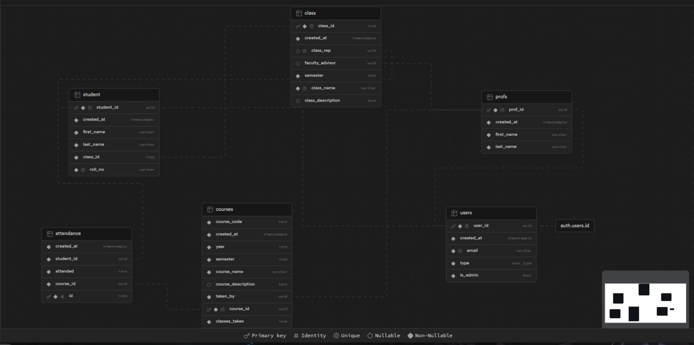

# Vision Attendance
Vision attendance is a web application that takes attendance using face recognition. It was designed for universities and colleges to make the jobs of professors taking attendance easier. Now, all a student has to, is to is click a button while facing the camera and their attendance will be recorded.

The application features 3 users - 
- Student: Can view their attendance, but not modify anything.
- Professor: Can view attendance of their lectures, take attendance, and edit attendance of their lectures.
- Admin: Can view, edit and delete all attendances.

Moreover, the application features a **spoofing classifier** which can tell if a student is faking attendance by showing a photo of them or a real face. This is useful in a university environment where proxy attendance is common and it is difficult to implement electronic or biometric ID verification.

## Features
- Face recognition and matching implemented using a pre-trained **[FaceNet pipeline](https://github.com/timesler/facenet-pytorch)** (MTCNN for face localization, InceptionResNetV1 for embedding generation), in real time.
- **YOLO v8** used for implementation of spoofing classifier -> TODO: need to retrain (due to lost weights) and incorporate as a check before above pipeline.
- Simple Web Application, developed with **React** frontend for ease in development and **Flask** backend to enable the CV pipeline to mesh easily with the CRUD API.  
- Backend RDBMS + Bucket Storage + Vectorized-Embeddings(**pgvector**, TODO) implemented using **5NF** PostgreSQL database, managed in **Supabase**.

## Database Design

